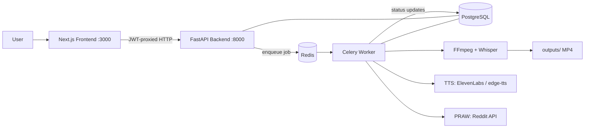
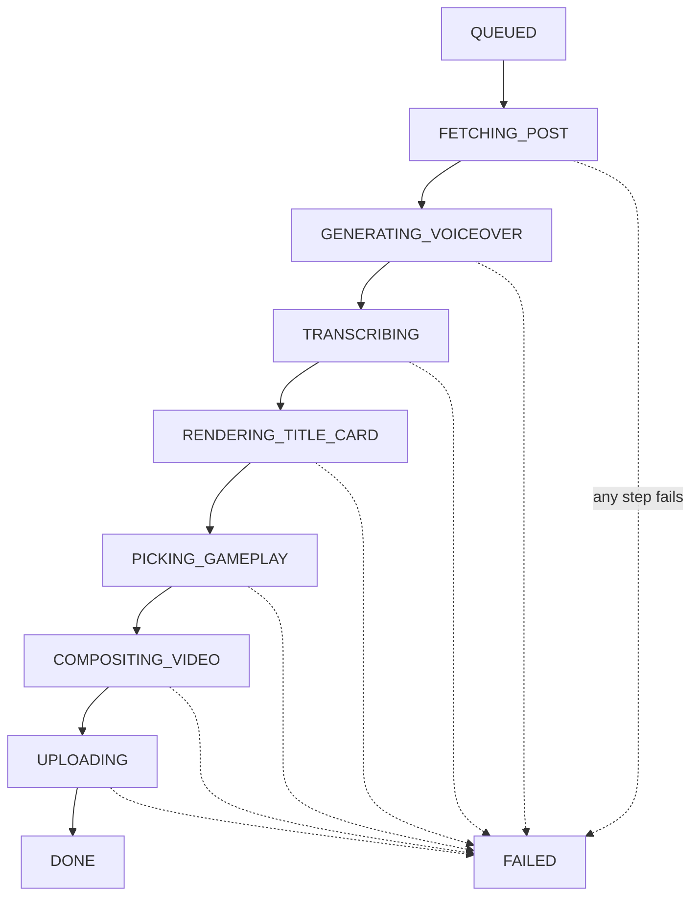
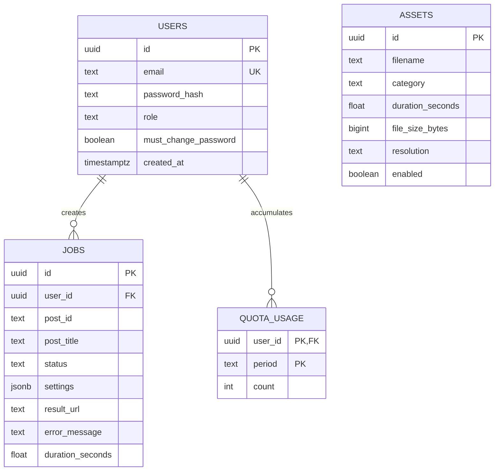

# ReelBot

Turn any Reddit post into a short-form vertical video (9:16, 1080×1920) ready for YouTube Shorts and Instagram Reels — AI voiceover, word-synced subtitles, and a looping gameplay background, generated end-to-end by a Celery + FFmpeg pipeline.

## Status

Work in progress. See [PROGRESS.md](./PROGRESS.md) for the live build checklist.

## Architecture

## Video Generation Pipeline

Job status is the source of truth, stored in PostgreSQL and polled by the frontend every 2s:

## Database

## Prerequisites

- Python 3.11+
- Node.js (LTS)
- FFmpeg (`brew install ffmpeg` / `apt install ffmpeg`)
- Docker (for Postgres + Redis via `docker-compose`)

## Setup

_Detailed setup instructions land in Phase 4 (feature/docs). Until then, follow PROGRESS.md._

## Documentation

Full setup guide, Reddit API credentials walkthrough, seed admin credentials, gameplay clip management, and environment variable reference will be completed in `feature/docs`.
